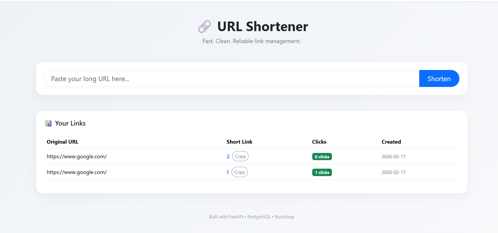

# 🔗 URL Shortener

A production-ready URL shortener built using **FastAPI** and **PostgreSQL** with Base62 encoding and real-time click analytics.

---

## 📸 Project Preview



> Clean dashboard with click tracking and analytics support.

---

## 🚀 Features

- 🔢 Base62 encoding for compact short URLs
- 🗄 PostgreSQL database persistence
- 📊 Click tracking & analytics
- 🔁 Automatic redirection
- 🖥 Clean dashboard UI (Bootstrap + Jinja)
- 🌍 Environment variable support
- 🐳 Dockerized deployment support
- ⚡ FastAPI REST architecture

---

## 🏗 How It Works

1. User submits a long URL
2. URL is stored in PostgreSQL
3. Auto-generated ID is encoded into Base62
4. Short code is saved and returned
5. Redirect endpoint increments click count
6. Dashboard displays analytics in real time

---

## 🛠 Tech Stack

- **Backend:** FastAPI
- **Database:** PostgreSQL
- **ORM:** SQLAlchemy
- **Frontend:** Bootstrap + Jinja Templates
- **Containerization:** Docker
- **Server:** Uvicorn

---

## 🚀 Run Locally

### 1️⃣ Install Dependencies
```bash
pip install -r requirements.txt

```

### 2️⃣ Run the Server  
```bash
uvicorn app.main:app --reload
```

### 3️⃣ Open the browser  
```bash
http://127.0.0.1:8000

```


---


## 🐳 Run With Docker

### Build Images
```bash
docker build -t url-shortener .
```

### Run Container
```bash
docker run -p 8000:8000 url-shortener

```

---

## 📊 API Endpoints

|   Method  |      Endpoint       |      Description         |
|-----------|---------------------|--------------------------|
|   POST    |      /shorten       |  Create short URL        |
|   GET     |    /{short_code}    | Redirect to original URL |
|   GET     | /stats/{short_code} | Retrieve analytics data  |

---

## 📂 Project Structure

```
app/
 ├── main.py
 ├── routes.py
 ├── models.py
 ├── schemas.py
 ├── database.py
 ├── base62.py
 └── templates/
      ├── index.html
      └── stats.html

```

---

## 🔮 Future Improvements

- User authentication (JWT)
- Rate limiting
- Expiring links
- Custom aliases
- QR code generation
- Cloud deployment (Render / Railway / Neon)


---

## 👨‍💻 Author

**Dhruv Bansal**
Electrical & Electronics Engineering @ VIT
Backend & AI Systems Enthusiast

--- 


## 📬 Contact  
📧 Email: dhruvbansal23731@gmail.com
🌐 GitHub: https://github.com/dbansal0607

---
